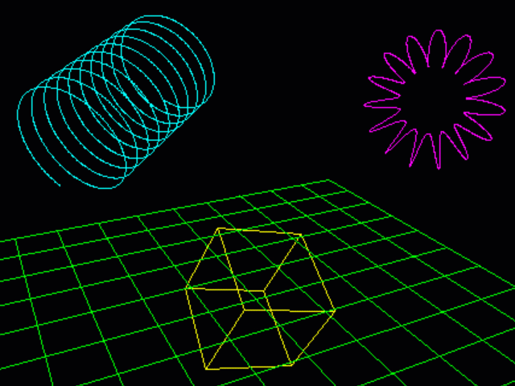
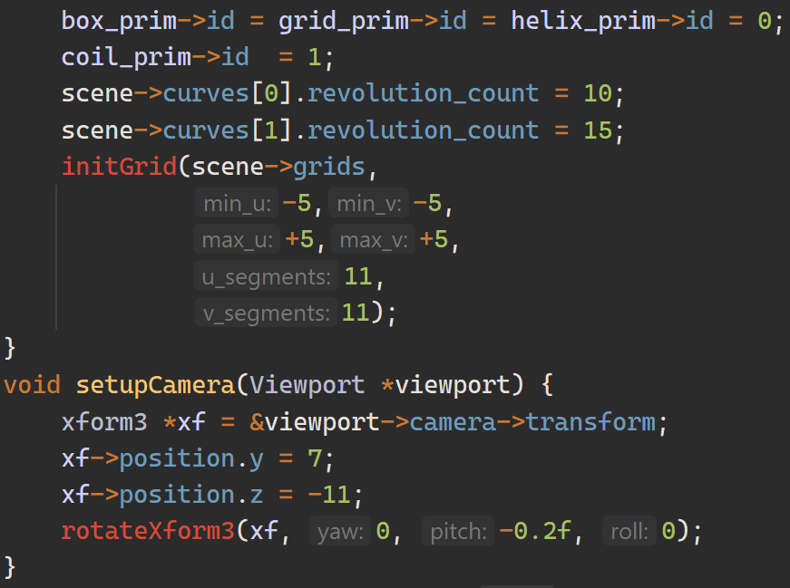
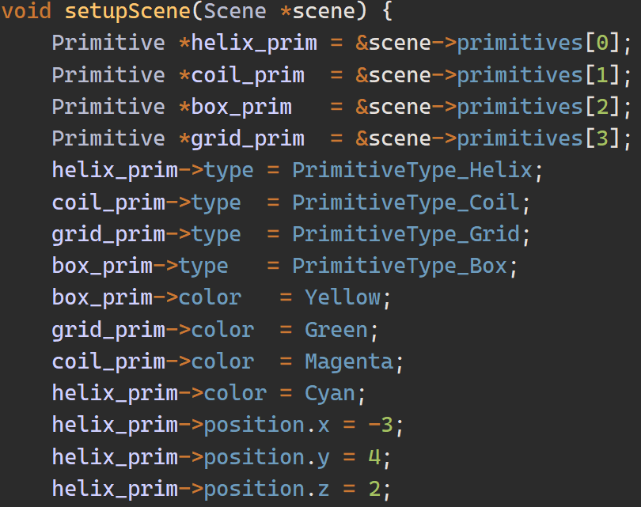
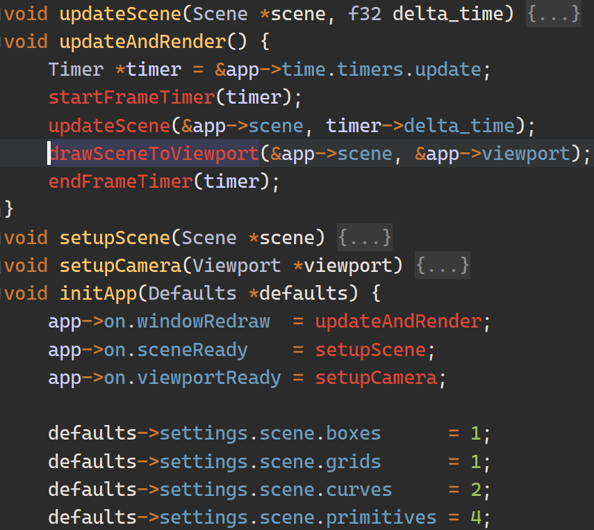

# SlimEngine

Minimalist, platform-agnostic, interactive render engine for writing graphical 2D/3D applications. 
Available as either a single header file or a directory of headers (a "unity build" setup). 
Can be complied in either C or C++. 

This project uses [SlimApp](https://github.com/HardCoreCodin/SlimApp) as it's base platform/application layer(s).

Architecture:
-
The platform layer only uses operating-system headers (no standard library used). 
The application layer itself has no dependencies, apart from the standard math header. 
It is just a library that the platform layer uses - it has no knowledge of the platform. 

More details on this architecture [here](https://youtu.be/Ev_TeQmus68).

Usage:
-
The single header file variant includes everything. 
Otherwise, specific headers can be included from the directory variant. 
The entry point needs to be defined (see [SlimApp](https://github.com/HardCoreCodin/SlimApp)).  

Features:
-
All features of SlimApp are available here as well. 
Additional features include facilities for interactive 3D application development: 
* A 3D viewport with wireframe rendering, a HUD and rich mouse/keyboard navigation. 
* A scene with cameras, meshes and parametric shapes. 
* Scene selection and interactive transformations (moving, rotating and scaling).

Well documented example applications cover the features: 

* Scene/camera setup and viewport drawing: 
  

    
    
    
    
  
