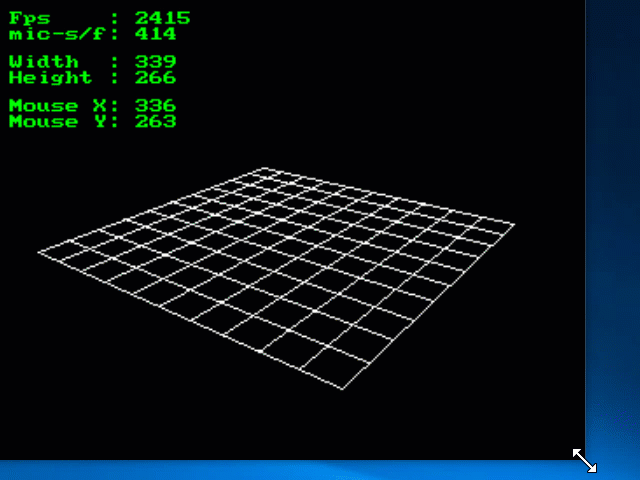
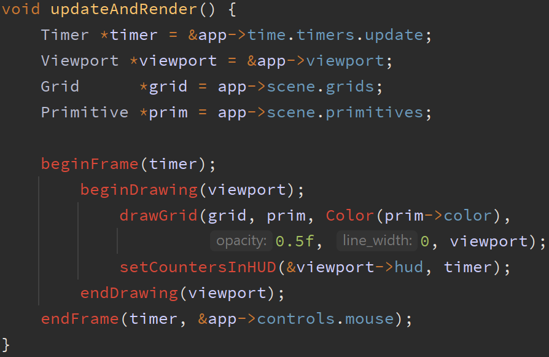
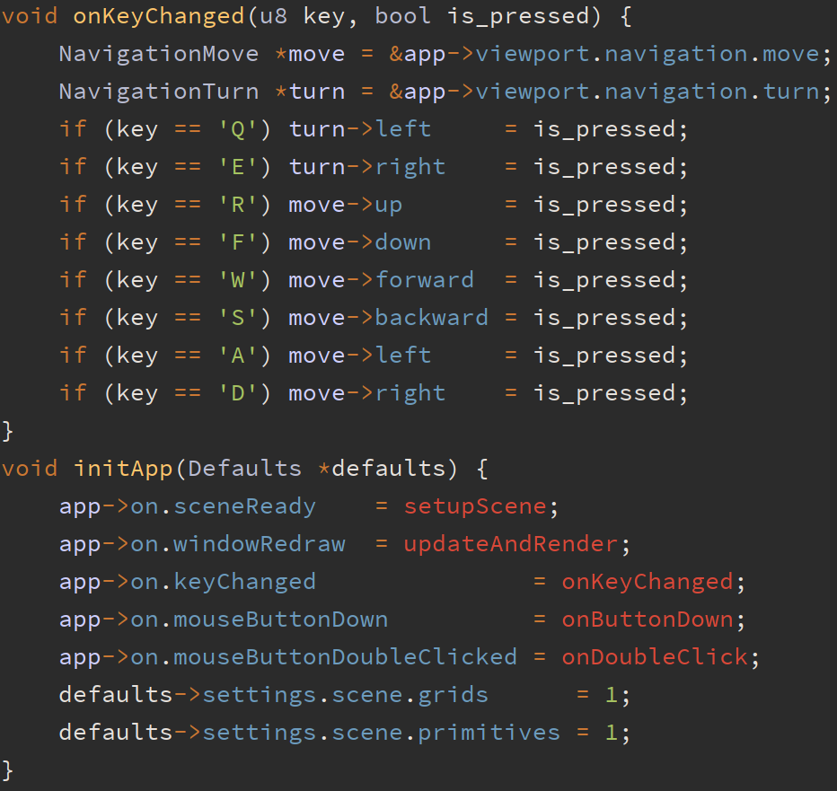
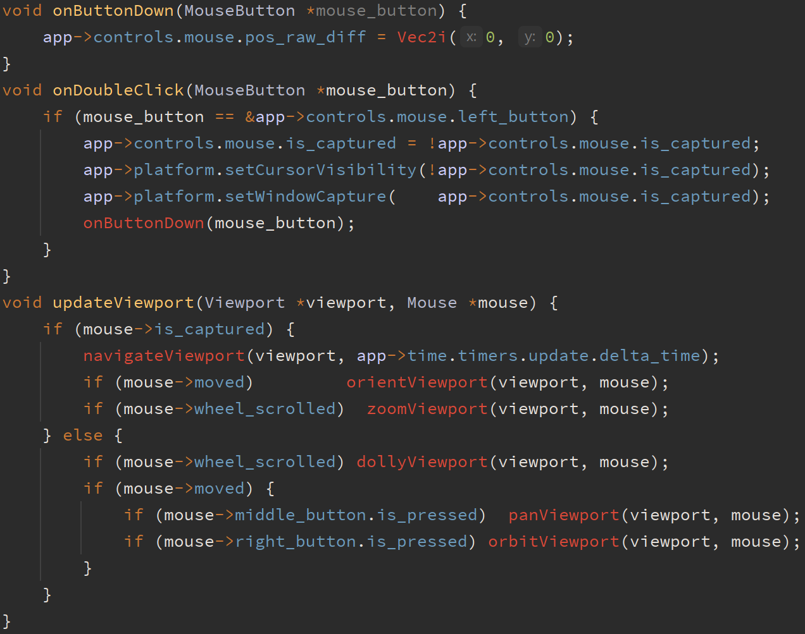

# SlimEngine

Minimalist, platform-agnostic, interactive render engine for writing graphical 2D/3D applications. 
Available as either a single header file or a directory of headers (a "unity build" setup). 
Can be complied in either C or C++. 

This project uses [SlimApp](https://github.com/HardCoreCodin/SlimApp) as it's base platform/application layer(s).

<i>(*A bare-bone application executable on Windows measures at around 17 KB(!)) </i>

Architecture:
-
The platform layer only uses operating-system headers (no standard library used). 
The application layer itself has no dependencies, apart from the standard math header. 
It is just a library that the platform layer uses - it has no knowledge of the platform. 

More details on this architecture [here](https://youtu.be/Ev_TeQmus68).

Usage:
-
The single header file variant includes everything. 
Otherwise, specific headers can be included from the directory variant. 
The entry point needs to be defined (see [SlimApp](https://github.com/HardCoreCodin/SlimApp)).  

Features:
-
All features of SlimApp are available here as well. 
Additional features include facilities for interactive 3D application development: 
* A 3D viewport with wireframe rendering, a HUD and rich mouse/keyboard navigation. 
* A scene with cameras, meshes and parametric shapes. 
* Scene selection and interactive transformations (moving, rotating and scaling).

Well documented example applications cover the features: 
* Viewport: HUD (Head-UP Display) 
  

    
    
    
    
  

  Viewports come with a HUD that can be toggled on/off 
  SlimEngine comes with an empty scene, apart from a default camera bound to a default viewport. 
  The window content is bound to the default viewport so they resize together. 

* Viewport: Navigation 
  

    
    
    
    
  

  Viewport navigation actions can be composed to set-up WASD(FPS)/DCC(orb) navigation style(s). 
  Keyboard navigation is agnostic to key-binding and is trivial to map keys to. 
  It supports moving forward, backwards, left, right, up and down and turning left or right. 
  Mouse navigation controls the viewport's camera and is more granular. 
  It can pan, zoom, dolly, orient or orbit the camera around a target. 
  
* Scene: Setup and drawing parametric primitives (Grid, Box, Curves, etc.) 
  

    
    
    
    
  

  SlimEngine allocates and initializes the scene based on quantities set at app-initialization time. 
  Customizing the scene/viewport can be done in callbacks that get invoked when they're ready. 
  Wireframe drawing of the scene to the viewport can be invoked manually on window-redraw.   

